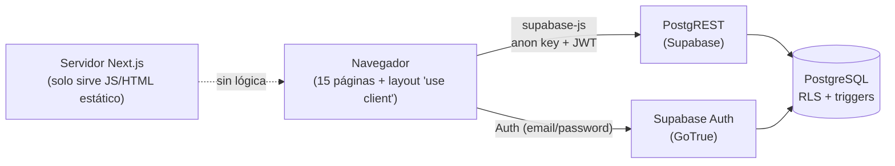

# Visión general de la arquitectura

> Base: commit `54962b9` · Confianza: **[Verificado]** salvo indicación.

## Qué es

Aplicación web de **punto de venta e inventario** para un solo negocio (no hay `tenant_id`/`store_id`
en el esquema: es *single-tenant*). Cubre: catálogo, ventas en caja, órdenes y reembolsos, clientes,
proveedores, stock y reportes básicos.

## Modelo de ejecución (lo más importante de entender)

- **No hay backend propio.** No existen `app/api/`, Server Actions ni `middleware.ts`/`proxy.ts`.
- **Toda la lógica de negocio corre en el navegador**: cálculo de totales, creación de orden, descuento
  de stock, reembolso, agregación de reportes.
- **El único control de acceso del lado servidor es RLS** en Postgres. Como las políticas vigentes
  permiten todo a cualquier usuario autenticado, en la práctica **no hay autorización**
  (ver [hallazgo C1](../04-auditoria/hallazgos/C1-rls-permisivo.md)).
- Next.js se usa como bundler y router. Ningún Server Component consulta datos.

## Stack

| Capa | Tecnología | Versión (`package.json`) | Notas |
|---|---|---|---|
| Framework | Next.js (App Router, Turbopack) | `16.1.6` | Tiene advisories; ver [dependencias](../04-auditoria/dependencias-npm-audit.md) |
| UI runtime | React | `19.2.3` | |
| Lenguaje | TypeScript | `^5` | `strict: true` |
| Estilos | Tailwind CSS | `^4` | vía `@tailwindcss/postcss`, sin `tailwind.config` |
| Componentes | shadcn/ui (estilo `new-york`) + Radix | varias `^1.x`/`^2.x` | 16 componentes en `components/ui/` |
| Backend | Supabase (Postgres, Auth, PostgREST) | `@supabase/supabase-js ^2.93.3` | cliente único en `lib/supabase/client.ts` |
| Estado | Zustand | `^5.0.10` | 3 stores; 2 con `persist` |
| Gráficas | Recharts | `^3.7.0` | solo en `/dashboard` |
| Fechas | date-fns | `^4.1.0` | |
| Notificaciones | Sonner | `^2.0.7` | |
| Tema | next-themes | `^0.4.6` | claro/oscuro/sistema |
| Iconos | lucide-react | `^0.563.0` | |
| Validación | zod `^4.3.6`, react-hook-form `^7.71.1`, `@hookform/resolvers` | — | **Instaladas pero sin ningún import** en `app/`, `lib/`, `stores/` |

## Mapa de rutas

Grupos de rutas: `(auth)` (públicas) y `(dashboard)` (con layout de sidebar).

| Ruta | Archivo | Propósito | Protección |
|---|---|---|---|
| `/` | `app/page.tsx` | `redirect('/login')` | — |
| `/login` | `app/(auth)/login/page.tsx` | Inicio de sesión | pública |
| `/register` | `app/(auth)/register/page.tsx` | Alta de usuario | pública |
| `/forgot-password` | `app/(auth)/forgot-password/page.tsx` | Envía email de recuperación | pública |
| `/reset-password` | **no existe** | Destino del enlace del email | — (**404**) |
| `/dashboard` | `app/(dashboard)/dashboard/page.tsx` | KPIs y gráficas | guarda cliente |
| `/pos` | `app/(dashboard)/pos/page.tsx` | Caja | guarda cliente |
| `/products` | `…/products/page.tsx` | CRUD de productos | guarda cliente |
| `/categories` | `…/categories/page.tsx` | CRUD de categorías | guarda cliente |
| `/inventory` | `…/inventory/page.tsx` | Stock (solo lectura) | guarda cliente |
| `/orders` | `…/orders/page.tsx` | Historial de ventas | guarda cliente |
| `/orders/[id]` | `…/orders/[id]/page.tsx` | Detalle, imprimir, reembolsar | guarda cliente |
| `/customers` | `…/customers/page.tsx` | Alta y listado | guarda cliente |
| `/customers/[id]` | `…/customers/[id]/page.tsx` | Detalle e historial | guarda cliente |
| `/suppliers` | `…/suppliers/page.tsx` | Alta y listado | guarda cliente |
| `/reports` | `…/reports/page.tsx` | Reportes | guarda cliente |
| `/settings` | `…/settings/page.tsx` | Ajustes (no persisten) | guarda cliente |

"Guarda cliente" = `app/(dashboard)/layout.tsx:44-67` comprueba la sesión en un `useEffect` y redirige.
No hay verificación en el servidor ni por rol. Detalle en [autenticación](03-autenticacion-y-sesion.md).

## Flujos principales

1. **Acceso:** `/login` → `signInWithPassword` → `/dashboard` → el layout carga `profiles` y llena `useAuthStore`.
2. **Venta:** `/pos` → clic en producto → `useCartStore.addItem` → Checkout → 5+ llamadas a Supabase
   desde el navegador. Ver [pos-checkout](../03-modulos/pos-checkout.md).
3. **Reembolso:** `/orders/[id]` → `update orders.status` → bucle de reposición de stock.
   Ver [ordenes-y-reembolsos](../03-modulos/ordenes-y-reembolsos.md).

## Límites y riesgos estructurales

- Sin transacciones: las operaciones multi-tabla no son atómicas ([C2](../04-auditoria/hallazgos/C2-checkout-no-atomico.md)).
- Sin validación de entrada ([H2](../04-auditoria/hallazgos/H2-sin-validacion.md)).
- Sin tests, CI, monitoreo ni migraciones versionadas ([medios y bajos](../04-auditoria/hallazgos/medios-y-bajos.md)).
- Sin paginación: cada lista descarga toda la tabla.

Para la dirección propuesta, ver [`06-roadmap/`](../06-roadmap/plan-de-remediacion.md).
