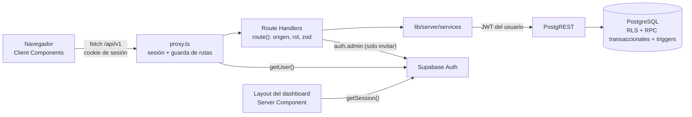

# Visión general de la arquitectura

> Actualizado tras la etapa 1. Confianza: **[Verificado]** salvo indicación (código, pruebas y BD local; nada de esto se ha aplicado aún a la base real
> ni se ha desplegado).

## Qué es

Aplicación web de **punto de venta e inventario** para un solo negocio (no hay `tenant_id`/`store_id`: es *single-tenant*, decisión D2 pendiente).
Cubre catálogo, caja, órdenes y reembolsos, clientes, proveedores, stock, reportes, ajustes y gestión de usuarios.

## Modelo de ejecución (lo más importante de entender)

- **El navegador no habla con Supabase**: solo con `/api/v1`. El lint prohíbe importar `@supabase/*` y `lib/server` desde `app/` y `components/`
  (única excepción, el layout del dashboard, que es un Server Component).
- **Dos capas de autorización independientes:** el rol se comprueba en `route()` y **RLS** decide los datos con el JWT del usuario. Ninguna de las dos
  confía en la otra.
- **La lógica de negocio vive en la base de datos** cuando toca dinero o stock: `create_sale`, `refund_order` y `adjust_inventory` son RPC
  transaccionales; los totales de clientes se derivan por trigger; los reportes se agregan en SQL. El cliente solo muestra una **vista previa** del carrito.
- **Sesión en cookies** (`@supabase/ssr`), no en `localStorage`. Detalle en [autenticación](03-autenticacion-y-sesion.md).
- Next.js hace de servidor de API, de renderizado del layout y de bundler.

## Stack

Las versiones son **exactas** (`package.json`, `bun.lock`); aquí solo las líneas mayores.

| Capa | Tecnología | Notas |
|---|---|---|
| Runtime / paquetes | Bun 1.4 (Node ≥ 20.9 para Next y Playwright) | `bunfig.toml`: versiones exactas, sin scripts de instalación (`trustedDependencies` vacío) |
| Framework | Next.js 16 (App Router, Turbopack), React 19 | `proxy.ts` (antes `middleware`), Route Handlers, headers de seguridad en `next.config.ts` |
| Lenguaje | TypeScript 5 (`strict`, `noUncheckedIndexedAccess`) | Tipos de la BD **generados** (`types/database.ts`) |
| Backend | Supabase local/hospedado: Postgres 17, Auth, PostgREST | `@supabase/supabase-js` + `@supabase/ssr`; migraciones en `supabase/migrations/` |
| Validación | zod 4 | Esquemas **compartidos** cliente/servidor (`lib/validation`) y del entorno (`lib/env`) |
| Formularios | react-hook-form + `@hookform/resolvers` | Con el mismo esquema zod que valida el servidor |
| UI | Tailwind CSS 4, shadcn/ui (`new-york`) sobre Radix, lucide-react, Sonner, next-themes, Recharts | [UI](06-ui-y-diseno.md) |
| Estado de cliente | Zustand (solo el carrito), contexto de sesión, `useApiQuery` | [Estado](04-estado-cliente.md) |
| Pruebas | `bun test`, happy-dom + Testing Library, Playwright | [Testing](../05-guias/testing.md) |
| CI | GitHub Actions + Dependabot | [Tooling](07-configuracion-y-tooling.md) |

## Mapa de rutas

Grupos: `(auth)` (públicas) y `(dashboard)` (layout con navegación). "Rol" = mínimo necesario; `proxy.ts` redirige y la API vuelve a comprobarlo.

| Ruta | Rol | Propósito | Módulo |
|---|---|---|---|
| `/` | — | `redirect('/login')` | — |
| `/login`, `/forgot-password` | pública | Acceso y recuperación | [autenticación](03-autenticacion-y-sesion.md) |
| `/reset-password` | sesión | Elegir contraseña (invitación o recuperación) | [autenticación](03-autenticacion-y-sesion.md) |
| `/auth/confirm` | pública | Canjea el enlace del correo por una sesión y redirige | [autenticación](03-autenticacion-y-sesion.md) |
| `/dashboard` | cajero | KPIs, ventas de 7 días, top productos, stock bajo | [dashboard](../03-modulos/dashboard.md) |
| `/pos` | cajero | Caja | [pos-checkout](../03-modulos/pos-checkout.md) |
| `/products`, `/categories` | cajero (lectura) · gerente (escritura) | Catálogo | [productos](../03-modulos/productos.md), [categorías](../03-modulos/categorias.md) |
| `/inventory` | cajero (lectura) · gerente (ajuste) | Stock | [inventario](../03-modulos/inventario.md) |
| `/orders`, `/orders/[id]` | cajero (las suyas) · gerente (todas y reembolso) | Historial y reembolsos | [órdenes](../03-modulos/ordenes-y-reembolsos.md) |
| `/customers`, `/customers/[id]` | cajero | Clientes | [clientes](../03-modulos/clientes.md) |
| `/suppliers` | gerente | Proveedores | [proveedores](../03-modulos/proveedores-y-compras.md) |
| `/reports` | gerente | Reportes por rango de fechas | [reportes](../03-modulos/reportes.md) |
| `/settings` | admin | Ajustes de la tienda | [ajustes](../03-modulos/ajustes.md) |
| `/users` | admin | Invitar, cambiar rol, desactivar | [usuarios](../03-modulos/usuarios.md) |

## Flujos principales

1. **Acceso:** `/login` → `POST /api/v1/auth/login` (cookies de sesión) → `/dashboard`; el layout servidor resuelve usuario y ajustes.
2. **Venta:** `/pos` → el cajero añade productos (solo ids y cantidades) → `POST /api/v1/sales` → `create_sale` en **una** transacción → orden con totales de la BD.
3. **Reembolso:** `/orders/[id]` (gerente) → `POST /orders/{id}/refund` → `refund_order`: marca la orden, repone stock y registra el movimiento; es idempotente.
4. **Alta de usuario:** admin invita → correo → `/auth/confirm` → `/reset-password` → sesión activa con el rol asignado.

## Límites conocidos

- **No probado en producción.** Las migraciones no se han aplicado a la base real y no hay despliegue (D13). Pasos en [migraciones](../02-base-de-datos/06-seed-y-migraciones.md).
- **Reglas de negocio sin validar** con el negocio: fiscalidad (D3), fidelidad (D7), stock (D9), descuentos (D6). Ver [decisiones pendientes](../06-roadmap/decisiones-pendientes.md).
- Sin recibo (solo `window.print()`), sin pagos mixtos ni vuelto (D5), sin variantes en el POS (D10), sin operación offline (D16), sin monitoreo.
- Órdenes de compra y gastos: solo esquema, sin API ni UI (etapa 2).
- Detalle de límites por módulo en `docs/03-modulos/`.
