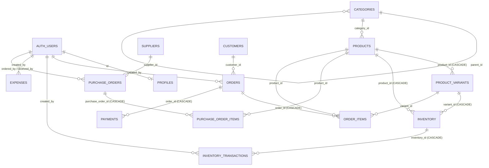

# Relaciones y diagrama ER

> Fuente: `supabase/schema.sql` · Confianza: **[Verificado]** contra el SQL.

`settings` no tiene relaciones (clave/valor). `inventory_transactions.reference_id` apunta lógicamente a
`orders` o `purchase_orders` **sin FK**.

## Reglas de borrado (efectos reales)

| Si se borra… | Efecto | Riesgo |
|---|---|---|
| `products` (sin ventas) | Se borran en cascada sus `product_variants`, `inventory` y, por éstos, `inventory_transactions` | Se **destruye la bitácora de stock** del producto |
| `products` (con ventas) | Falla por FK desde `order_items.product_id` (sin cascade) | Correcto, pero la UI solo muestra el mensaje de Postgres. Debería usarse `is_active=false` |
| `orders` | Se borran `order_items` y `payments` | Con RLS permisivo, **cualquier usuario puede borrar ventas y pagos**, borrando registros financieros |
| `categories` en uso | Falla por FK desde `products.category_id` | Sin mensaje amigable |
| `customers` con órdenes | Falla por FK desde `orders.customer_id` | |
| `auth.users` (desde el panel de Supabase) | Falla mientras exista su fila en `profiles` (FK sin cascade) | Impide dar de baja usuarios; añadir `ON DELETE CASCADE` o desactivar en lugar de borrar |

## Cardinalidades y particularidades

- **Producto ↔ inventario:** debería ser 1 fila por (producto, variante). Con `variant_id` NULL la
  restricción `UNIQUE` **no se aplica**, por lo que puede haber varias filas para el mismo producto.
  Además la app **no crea** filas de inventario al crear un producto (el README dice lo contrario).
- **Orden ↔ pago:** modelado como 1:N, usado como 1:1.
- **Orden ↔ creador:** FK a `auth.users`, no a `profiles`. Consultar el creador con un embed
  `profiles!orders_created_by_fkey` **[Por verificar]**; una relación válida requeriría una FK directa a `profiles`.
- **Categorías anidadas:** existe `parent_id`; ninguna pantalla lo usa.
