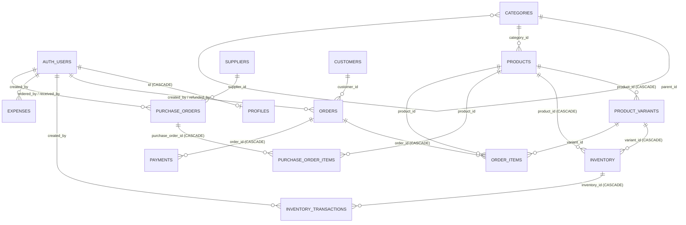

# Relaciones y diagrama ER

> Actualizado tras la etapa 1 (extraído de `pg_constraint` de la BD local) · Confianza: **[Verificado]**.

`settings` no tiene relaciones (clave/valor). `inventory_transactions.reference_id` apunta lógicamente a
`orders` o `purchase_orders` **sin FK**. `purchase_orders` también puede apuntar a `business_days` y `cash_sessions`; `inventory_transactions.supplier_id` → `suppliers` en compras. **[Por verificar]**.

## Reglas de borrado (efectos reales)

Ninguna de las tablas de ventas y stock se borra desde la API (privilegios revocados); esto es lo que hace la **base de datos** si alguien con acceso directo lo intenta:

| Si se borra… | Efecto | Cómo se evita en la práctica |
|---|---|---|
| `products` (con ventas) | Falla por FK desde `order_items.product_id` (sin cascade) | La API hace **borrado lógico** (`deleted_at`); el borrado físico es solo admin y falla si hay ventas |
| `products` (sin ventas) | Cascada a `product_variants`, `inventory` y `inventory_transactions` (se pierde su bitácora) | Solo admin; usar borrado lógico |
| `orders` | Cascada a `order_items` y `payments` | Sin privilegio `DELETE` para `authenticated` (ni admin) |
| `categories` en uso | Falla por FK desde `products.category_id` → la API responde **409** | Mensaje claro en la UI |
| `customers` con órdenes | Falla por FK desde `orders.customer_id` | Solo admin y sin UI |
| `auth.users` | Se borra su `profiles` (**CASCADE**) | Preferir **desactivar** (`is_active = false`) para conservar la trazabilidad (`created_by` no tiene cascade) |

## Cardinalidades y particularidades

- **Producto ↔ inventario:** una fila por (producto, variante); para productos sin variante, el índice parcial único garantiza **una sola**. El trigger `create_inventory_for_product` la crea (cantidad 0) al insertar el producto.
- **Orden ↔ pago:** 1:N. Un cobro lleva uno o dos métodos (D5).
- **Jornada ↔ orden / pago:** opcional. Sin jornada abierta el id queda nulo. Una sesión de caja pertenece a una jornada y a una caja; los responsables están en `cash_session_users`.
- **Orden ↔ creador:** FK a `auth.users`, no a `profiles`, así que PostgREST **no puede embeber** el perfil: el servicio consulta el perfil aparte (`created_by_name`). El antiguo embed `profiles!orders_created_by_fkey` no funcionaba.
- **Categorías anidadas:** existe `parent_id`; ninguna pantalla lo usa.
- **`inventory_transactions.reference_id`** apunta lógicamente a una orden o compra **sin FK** (así las bitácoras sobreviven a su origen).
