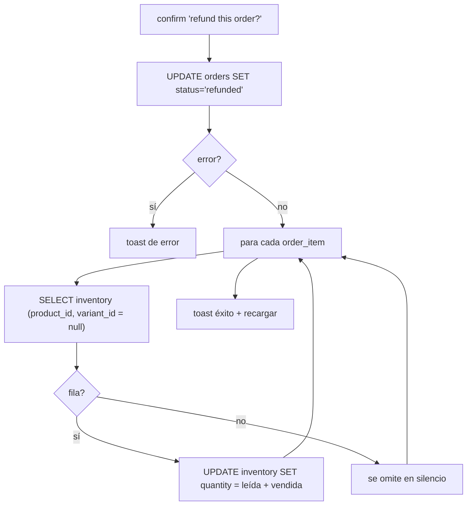

# Módulo: Órdenes y reembolsos

> Archivos: `app/(dashboard)/orders/page.tsx` (121), `app/(dashboard)/orders/[id]/page.tsx` (252) · Base: commit `54962b9`

## Listado — `/orders`

- Consulta: `orders` con `customer:customers(*)`, orden `created_at desc`, **sin paginar** (`orders/page.tsx:24-31`).
- Búsqueda en memoria por `order_number` y nombre de cliente. Nota: `order.customer?.name.toLowerCase()` falla
  con `TypeError` si un cliente existe pero su `name` fuera `null`; hoy `name` es `NOT NULL`, así que no ocurre.
- Estado con `Badge`: `completed` → default, `pending` → secondary, `refunded` → destructive, resto → outline.
- Navegación: `router.push('/orders/<id>')`.
- Lint: `fetchOrders` se usa antes de declararse (`react-hooks/immutability`) y hay `as any` (ver [lint](../04-auditoria/lint-y-tipos.md)).

## Detalle — `/orders/[id]`

Carga en dos consultas (`:29-50`):

1. `orders` con `customer:customers(*)` y `created_by_user:profiles!orders_created_by_fkey(*)` (`.single()`).
2. `order_items` con `product:products(*)` y `variant:product_variants(*)` por `order_id`.

Muestra: número, fecha (`format(..., 'PPp')`), estado, "Created By", datos del cliente, tabla de ítems
(producto, variante, cantidad, precio, descuento, impuesto, total) y resumen (subtotal, descuento, impuesto, total).

Observaciones:
- **"Created By" muestra el UUID crudo** (`order.created_by || 'System'`, `:160`); el embed `created_by_user`
  se pide pero no se usa.
- **[Por verificar]** El embed `profiles!orders_created_by_fkey`: esa FK apunta a `auth.users`, no a `profiles`.
  Si PostgREST no puede resolver la relación, devuelve error y `orderData` queda `null`, mostrando
  "Order not found". El commit `54962b9` ("Fix TypeScript error … created_by field") sugiere que esto se
  tocó recientemente. Probar abriendo una orden real.
- Los errores de las consultas no se revisan (solo el `catch`, que nunca dispara con `supabase-js`, ya que este
  devuelve `{ error }` en lugar de lanzar).
- **No se muestra el pago** (método, monto): `payments` no se consulta.

## Impresión

`window.print()` (`:89-91`). Los controles llevan `print:hidden`. No hay plantilla de recibo ni datos de la
tienda; ver [UI](../01-arquitectura/06-ui-y-diseno.md).

## Reembolso — `handleRefund` (`:52-87`)

Visible solo si `order.status === 'completed'`. Flujo:

### Defectos [Verificado]

| # | Defecto | Efecto |
|---|---|---|
| 1 | El estado cambia **antes** de reponer el stock, sin transacción | Si falla la reposición, la orden queda `refunded` y el stock sin devolver |
| 2 | Mismo `eq('variant_id', null)` que el POS (`:71`) | La reposición probablemente **no encuentra la fila** y se omite en silencio |
| 3 | Lectura-modificación-escritura del stock | Carrera con ventas simultáneas |
| 4 | **No es idempotente** en servidor: no valida `status = 'completed'` en el `UPDATE` | Un doble clic o dos pestañas pueden reponer stock dos veces |
| 5 | No registra `inventory_transactions` de tipo `return` | La bitácora no refleja la devolución |
| 6 | No revierte ni marca el **pago** | `payments` sigue mostrando el cobro; el reporte de caja no cuadra |
| 7 | No ajusta `customers.total_spent` / `loyalty_points` | (Hoy irrelevante porque nunca se suman, pero será un error al implementarlo) |
| 8 | Sin motivo, sin quién/cuándo, sin reembolso parcial por ítem | Sin trazabilidad |
| 9 | Cualquier usuario autenticado puede reembolsar | El diseño original limitaba `UPDATE orders` a admin/manager, pero el parche RLS lo abrió ([C1](../04-auditoria/hallazgos/C1-rls-permisivo.md)) |
| 10 | `confirm()` nativo | Ver [UI](../01-arquitectura/06-ui-y-diseno.md) |

## Diseño objetivo

`supabase.rpc('refund_order', { order_id, reason })`: en una transacción, `UPDATE orders SET status='refunded'
WHERE id=$1 AND status='completed'` (si no afecta filas → error), reponer stock con `UPDATE … quantity = quantity + n`,
insertar `inventory_transactions` tipo `return`, registrar el reembolso del pago, y guardar `refunded_by`/`refunded_at`/`reason`.
Permiso: solo gerente/admin. Ver [borrador](../06-roadmap/diseno-objetivo-seguridad.md).
