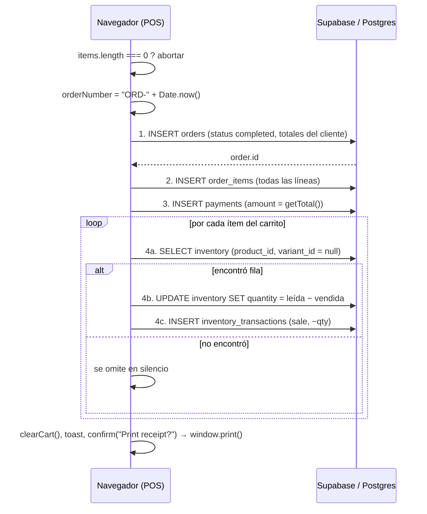

# Módulo: Punto de venta y checkout

> ⚠️ **Describe el estado ANTERIOR a la etapa 1 (commit `54962b9`).** Desde entonces el navegador solo habla con `/api/v1`, RLS es por rol y la
> lógica de negocio vive en RPC de la BD: ver [API](../01-arquitectura/08-api.md) y [triggers y funciones](../02-base-de-datos/04-triggers-y-funciones.md). Este documento se reescribe en el Paso 8.

> Archivo: `app/(dashboard)/pos/page.tsx` (419 líneas) + `stores/cart.ts` · Base: commit `54962b9`
> Es el archivo **más crítico** del sistema: crea dinero y mueve stock. Hallazgo asociado: [C2](../04-auditoria/hallazgos/C2-checkout-no-atomico.md).

## Qué hace

Pantalla de dos columnas: catálogo a la izquierda, carrito y resumen a la derecha. El cajero busca o toca
productos, ajusta cantidades, opcionalmente elige cliente y descuento, y cobra en un diálogo de pago.

## Carga de datos (`pos/page.tsx:36-78`)

Al montar, tres consultas independientes, sin manejo de error:

| Consulta | Filtro |
|---|---|
| `products` | `select *` con `is_active = true` |
| `categories` | `select *` |
| `customers` | `select *` con `is_active = true` |

- Búsqueda (nombre, SKU, código de barras) y filtro por categoría se aplican **en memoria**
  (`useEffect` a `filteredProducts`, `:42-58`). Todo el catálogo activo vive en el navegador.
- **Lector de código de barras:** el texto entra al cuadro de búsqueda como cualquier tecleo. No hay
  manejo de `Enter` ni auto-agregado al carrito.
- La tarjeta de producto **no muestra stock** y el sistema **no valida stock disponible** al agregar ni al cobrar.
- No se usan variantes: `addItem(product)` (`:224`) siempre sin variante. `image_url` no se muestra (ícono genérico).

## Carrito (`stores/cart.ts`)

Ver fórmulas y defectos en [estado del cliente](../01-arquitectura/04-estado-cliente.md). Puntos del POS:

- Descuento global: `<Input type="number" min="0" step="0.01">` que ejecuta `setGlobalDiscount(Number(value))`
  (`:333-340`). En **moneda**, sin tope, sin permiso, sin motivo, sin auditoría. `min` es solo HTML.
- El **cliente** se elige con un `Select` sin opción "Walk-in": una vez elegido no se puede volver a
  "sin cliente" salvo terminando la venta (`setSelectedCustomer('')` tras cobrar).
- `key` de cada línea incluye el índice (`:279`), lo que degrada la reconciliación al borrar líneas.

## Diálogo de pago

Tres botones (Cash / Card / E-Wallet) que fijan `paymentMethod`. **No hay** monto recibido, vuelto,
pagos mixtos, referencia de tarjeta ni validación. `payments.amount` se fija a `getTotal()`.
El botón "Complete Order" se deshabilita con `processing`, pero "Checkout" no.

## Flujo de `handleCheckout` (`:80-182`)

### Detalle de cada paso

| # | Líneas | Operación | Notas |
|---|---|---|---|
| 1 | `:90-108` | `orders.insert({order_number, customer_id, status:'completed', subtotal, discount, tax, total, created_by})` | Totales del **cliente**. `created_by: user?.id` es `undefined` si el perfil no cargó |
| 2 | `:111-126` | `order_items.insert(...)` | `unit_price` del `Product` cacheado. `tax` por línea usa `product.tax_rate` (≠ tasa global de la orden). Incluye líneas con cantidad 0 |
| 3 | `:129-137` | `payments.insert({order_id, payment_method, amount})` | |
| 4 | `:140-165` | por ítem: `select` inventario → `update` → `insert` transacción | **Resultados de `update` e `insert` no se revisan**. `.eq('variant_id', item.variant?.id \|\| null)` no coincide con `NULL` |
| 5 | `:167-175` | limpiar carrito, toast, `confirm`, `window.print()` | La impresión ocurre tras vaciar el carrito |

## Qué puede salir mal (y qué queda en la base)

| Fallo | Estado resultante |
|---|---|
| Falla el paso 1 | Nada se escribe (correcto) |
| Falla el paso 2 | **Orden `completed` sin ítems ni pago**; stock intacto |
| Falla el paso 3 | Orden con ítems **sin pago**; stock intacto |
| El `select` de inventario no encuentra fila (o el filtro `eq.null` falla) | **Venta completada sin descontar stock**, sin aviso |
| Falla un `update` de inventario | Stock incorrecto; el toast dice "Order completed successfully!" |
| Corte de red entre pasos | Cualquiera de los estados anteriores |
| Dos cajas venden el mismo producto | Ambas leen `quantity=N` y escriben `N−1`: se pierde una venta (condición de carrera) |
| Doble clic rápido en "Complete Order" | Posible orden duplicada antes de que `processing` deshabilite el botón |
| `Date.now()` idéntico en dos cajas (mismo ms) | Choque de `UNIQUE(order_number)` → la segunda venta falla |

## Riesgos de integridad y fraude

- El cliente decide **precio, descuento, impuesto y total**. Con RLS permisivo, un usuario puede insertar
  directamente una orden con `total: 0` desde la consola.
- Precio potencialmente **obsoleto**: el carrito persiste el `Product` completo en `localStorage`.
- Sin control de stock negativo: `inventory.quantity` no tiene `CHECK`.
- El cajero no tiene límites de descuento ni requiere aprobación.

## Diseño objetivo

`supabase.rpc('create_sale', { customer_id, items:[{product_id, variant_id, quantity, discount}], payment_method, discount })`
ejecutada en **una transacción** que: bloquea las filas de inventario (`FOR UPDATE`), verifica stock,
lee precios e impuestos de la BD, calcula totales, inserta orden/ítems/pago/transacciones, descuenta con
`UPDATE … SET quantity = quantity − n WHERE quantity >= n` y devuelve el `order_id`. El cliente solo
envía ids y cantidades. Borrador en [`diseno-objetivo-seguridad.md`](../06-roadmap/diseno-objetivo-seguridad.md).

## Cómo verificar el comportamiento actual

[`05-guias/verificar-checkout.md`](../05-guias/verificar-checkout.md).

## Casos de prueba sugeridos (para cuando haya tests)

1. Venta de 1 producto con stock 50 → stock 49, 1 transacción `sale`, 1 orden, 1 ítem, 1 pago.
2. Venta con stock 1 y cantidad 2 → rechazada; nada se escribe.
3. Dos ventas simultáneas del último ítem → solo una tiene éxito.
4. Precio cambiado en BD tras cargar el POS → se cobra el precio vigente de la BD.
5. Descuento mayor al subtotal → rechazado.
6. Fallo forzado en el paso de pago → ninguna fila persiste (rollback).
7. Carrito con línea de cantidad 0 → no genera `order_items`.
