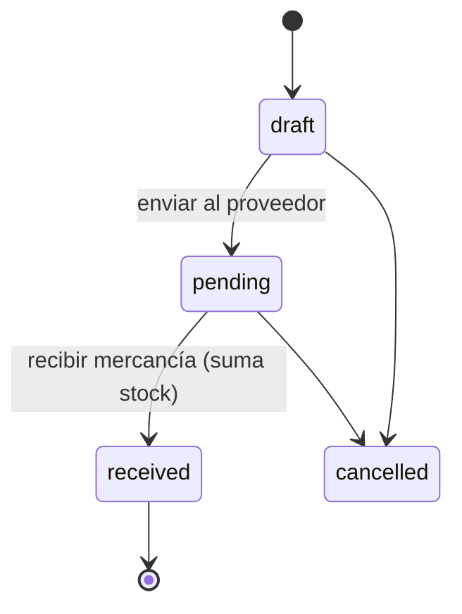

# Módulo: Proveedores y compras

> Archivo: `app/(dashboard)/suppliers/page.tsx` (172 líneas) · Base: commit `54962b9`

## Proveedores — `/suppliers`

- Lista `suppliers` (`created_at desc`), buscador en memoria por nombre, tarjeta con el total.
- **Solo alta y lectura.** Formulario: `name`, `contact_person`, `email`, `phone`, `address`. No incluye
  `notes` ni `is_active` (columnas existentes). Sin editar ni borrar.
- Errores de alta se muestran con el mensaje crudo de Postgres.

## Órdenes de compra — **no implementadas en la UI**

Las tablas `purchase_orders` y `purchase_order_items` existen (con enum `po_status`, columnas
`ordered_by`, `received_by`, `total` generado en los ítems), pero **ningún archivo de la app las consulta**
(verificado por búsqueda de `from('purchase_orders')`). El README las lista como "Purchase order system (ready)":
solo está listo el **esquema**.

Tampoco hay UI para `expenses` ni para `settings`.

## Flujo previsto (no construido)

Al pasar a `received` debería: sumar `inventory.quantity` por ítem, registrar `inventory_transactions`
de tipo `purchase`, poner `received_by`/`received_at`, y actualizar `last_restocked_at`. Todo en una
transacción (RPC `receive_purchase_order`).

## Defectos y riesgos

| # | Detalle |
|---|---|
| 1 | Sin edición/borrado/desactivación de proveedores |
| 2 | Sin flujo de compras: la única forma de aumentar stock es SQL manual |
| 3 | RLS `ALL` para cualquier usuario autenticado sobre proveedores y compras |
| 4 | Sin unicidad de nombre/email de proveedor |
| 5 | `catch (error: any)` (lint) |

## Prioridad

Media. Sin recepción de compras, el inventario no puede mantenerse desde la aplicación; conviene
construir junto con la pantalla de ajustes de [inventario](inventario.md).
